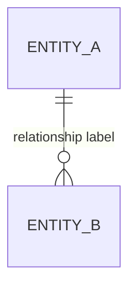

# Conceptual Design (ERD) — Group G##

## Mermaid ERD

## Entity Definitions
| Entity | Attributes (key ones) | Traced to (step 1 item) |
|---|---|---|
| | | |

## Relationship Definitions
| Relationship | Cardinality | Justification |
|---|---|---|
| | | |

## Open Questions Carried Forward
- ...
