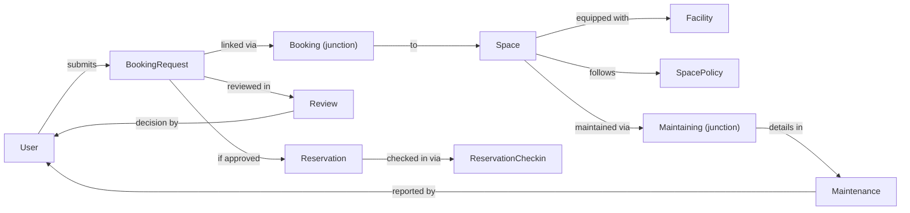
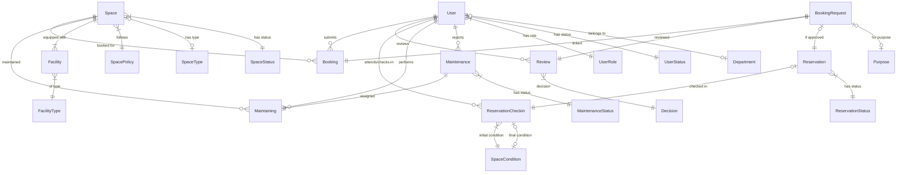

# CS486 Database Design Project — Tutor Review & Design Explanation

**Group:** G06  
**DBMS:** Microsoft SQL Server  
**Domain:** Campus Space Booking & Management System — School of Computer Science  
**Reviewed:** 2026-07-06  

---

## Table of Contents

1. [Executive Summary](#executive-summary)
2. [System Overview & Design Explanation](#system-overview--design-explanation)
3. [Step-by-Step Pipeline Evaluation](#step-by-step-pipeline-evaluation)
4. [Database Schema Map](#database-schema-map)
5. [Strengths](#strengths)
6. [Weaknesses & Issues](#weaknesses--issues)
7. [Recommendations](#recommendations)
8. [Scoring Summary](#scoring-summary)

---

## Executive Summary

This project implements a relational database for managing the booking, approval, usage, and maintenance of shared physical spaces (classrooms, auditoriums, labs, meeting rooms, etc.) at a School of Computer Science. The design follows a rigorous 7-step pipeline from business requirements through to executable SQL queries. The team demonstrates strong awareness of normalization principles, referential integrity, and data validation. The schema is well-structured with clear separation between operational entities, junction/associative entities, and lookup/reference tables. Several areas — particularly trigger logic, CHECK constraint patterns, and naming conventions — deserve attention for a production-ready system.

---

## System Overview & Design Explanation

### What the System Does

The School of Computer Science needs to move from manual spreadsheet-and-email space management to a structured database. The system tracks:

- **Users** — students, lecturers, TAs, facility staff, administrators, and managers
- **Spaces** — classrooms, auditoriums, labs, meeting rooms, study areas, staffrooms
- **Facilities** — equipment within each space (projectors, chairs, whiteboards, computers, etc.)
- **Booking Requests** — users request a space for a time slot with a stated purpose
- **Reviews** — facility staff approve or reject booking requests
- **Reservations** — approved bookings become reservations that can be checked in
- **Check-ins** — staff record actual usage times and space condition before/after
- **Maintenance** — broken equipment or facility issues are logged and tracked to completion

### How the Entities Connect

The following diagram shows the high-level data flow:



### Entity Classification

The project employs a thoughtful **three-tier entity classification**:

| Tier | Purpose | Examples |
|------|---------|---------|
| **Operational entities** | Core business objects with their own lifecycle | `User`, `Space`, `BookingRequest`, `Reservation`, `Maintenance`, `SpacePolicy` |
| **Junction / associative entities** | Model M:N or ternary relationships with their own attributes | `Booking`, `Review`, `ReservationCheckin`, `Maintaining` |
| **Reference (lookup) entities** | Enum-like code tables providing domain-controlled values | `SpaceType`, `UserRole`, `SpaceStatus`, `Department`, `Purpose`, `Decision`, `ReservationStatus`, `MaintenanceStatus`, `UserStatus`, `SpaceCondition`, `FacilityType` |

### Schema Organization in SQL Server

The DDL separates tables into schemas:
- **`dbo`** (default) — operational entities (`User`, `Space`, `BookingRequest`, `Reservation`, `Maintenance`, `SpacePolicy`, `Facility`)
- **`lookup_table`** — all 11 reference/enum tables
- **`junction_table`** — all 4 junction/associative tables (`Booking`, `Review`, `ReservationCheckin`, `Maintaining`)

> [!TIP]
> This schema separation is a strong organizational choice. It makes the database self-documenting — any developer can immediately distinguish operational tables from reference data and join tables.

---

## Step-by-Step Pipeline Evaluation

### Step 1: Business Requirement Analysis

**File:** [01-business-req-analysis-G06.md](01-business-req-analysis-G06.md)  
**Verdict:** ✅ Thorough and well-structured

| Criterion | Assessment |
|-----------|-----------|
| Actors identified | ✅ Five actor types (DBA, designer, casual, naive, sophisticated) |
| Entities & attributes listed | ✅ Comprehensive — 6 operational entities, 8 reference entities, 1 associative entity |
| Relationships & cardinalities | ✅ All relationships with explicit cardinality ratios and participation constraints |
| Constraints cataloged | ✅ Both explicit (attribute-level) and semantic (business-rule) constraints |
| Assumptions recorded | ✅ ID formats, composite attributes, optional participations |

**Design Choices Explained:**

- **Composite attributes**: `full_name → (surname, given_name)`, `space_location → (building, floor, room_number)`, `requested_time_slot → (start, end)`. This decomposition follows 1NF atomicity requirements.
- **ID format choices**: User IDs are 8-digit numeric (non-enumerable for security), booking request IDs are 8-char lowercase alphanumeric, reservation IDs are 8-char uppercase. This deliberate casing distinction makes visual identification trivial.
- **Facility composite key**: `(facility_type_id, facility_sequence_number)` — a composite PK that encodes the facility's type and sequence, e.g., Chair #55 is `(1, 55)`.

> [!NOTE]
> The analysis distinguishes between explicit constraints (enforceable in DDL) and semantic constraints (requiring triggers or application logic). This separation shows mature understanding of what a DBMS can and cannot enforce declaratively.

---

### Step 2: Conceptual ERD (Chen Notation)

**File:** [02-erd-design-G06.md](02-erd-design-G06.md)  
**Diagrams:** [conceptual.svg](../assets/conceptual.svg) → [refined_conceptual.svg](../assets/refined_conceptual.svg)  
**Verdict:** ✅ Clear with good notation conventions

| Criterion | Assessment |
|-----------|-----------|
| Chen notation used correctly | ✅ Diamonds for relationships, ovals for attributes, rectangles for entities |
| Custom notation documented | ✅ Color coding: red = operational, cyan = reference, teal = associative |
| Cardinalities shown | ✅ On all relationship endpoints |
| Participation constraints | ✅ Single vs. double lines for partial vs. total participation |

**Notable design decision:** The `checks_in` relationship was initially modeled as a ternary relationship (User × User × Reservation), capturing both the person checking in and the facility attendant monitoring the session. This was later promoted to an associative entity `ReservationCheckin` to accommodate FK references to `SpaceCondition`.

---

### Step 3: Logical Design (Crow's Foot Notation)

**File:** [03-logical-design-G06.md](03-logical-design-G06.md)  
**Diagrams:** [logical.svg](../assets/logical.svg) → [refined_logical.svg](../assets/refined_logical.svg)  
**Mermaid source:** [refined_logical.mmd](../assets/refined_logical.mmd)  
**Verdict:** ✅ Correct transformation from conceptual

| Criterion | Assessment |
|-----------|-----------|
| All entities mapped to tables | ✅ 17 tables total |
| Ternary relationships resolved | ✅ Via junction tables (`Booking`, `ReservationCheckin`, `Maintaining`) |
| FK migration correct | ✅ FKs placed on the "many" side of 1:N relationships |
| PKs defined | ✅ Composite PKs for junction tables, single PKs for entities |

**Key transformation decisions:**
- Ternary `books(User, Space, BookingRequest)` → junction table `Booking` with 3-column composite PK
- Ternary `checks_in(User, User, Reservation)` → associative entity `ReservationCheckin` with 3-column composite PK
- Ternary `maintains(User, Space, Maintenance)` → junction table `Maintaining` with `maintenance_id` as PK
- Binary 1:1 `from_request(Reservation, BookingRequest)` → FK in `Reservation`

---

### Step 4: Design Validation & Refinement

**File:** [04-design-validation-G06.md](04-design-validation-G06.md)  
**Verdict:** ✅ Valuable iteration that strengthened the design

Key refinements made:

| Change | Rationale |
|--------|-----------|
| `Space–Facility` cardinality changed to `(1,N)` and `(1,1)` | Clarified with users: every space must have ≥1 facility, every facility belongs to exactly one space |
| `policy` text attribute → `SpacePolicy` entity | Structured policy with `booking_window_days`, `min/max_duration_minutes`, `check_in_grace_minutes` |
| `user_status` attribute → `UserStatus` reference entity | Consistent enum treatment |
| `space_condition` attribute → `SpaceCondition` reference entity | Enabled FK references from `ReservationCheckin` |
| `request_creation_time` added to `BookingRequest` | Track when the request was submitted |
| `checks_in` relationship → `ReservationCheckin` associative entity | Needed to participate in FK relationships with `SpaceCondition` |

**Reference entity domains** are fully enumerated — 11 lookup tables with all domain values. This is excellent for a design document.

---

### Step 5: DDL (Database Definition)

**File:** [05-db-definition-G06.sql](05-db-definition-G06.sql)  
**Verdict:** ⚠️ Solid foundation with some issues requiring attention

**What's done well:**
- Proper use of `IDENTITY(1,1)` for auto-incrementing lookup PKs
- `NVARCHAR` for user-facing text (supports Vietnamese names like `Nguyễn Quốc Nam`)
- `VARCHAR` for system codes — appropriate and space-efficient
- Named constraints (`PK_`, `FK_`, `UK_`, `CHK_` prefixes) — excellent maintainability
- CHECK constraints enforce ID format rules, uppercase codes, positive values
- 10 triggers enforce complex semantic constraints that can't be expressed as CHECK constraints

**Issues identified:**

> [!WARNING]
> **Trigger `trg_booking_requested_time_fit_policy` (lines 582–613):** The `DATEDIFF` arguments are in the wrong order. Currently:
> ```sql
> DATEDIFF(MINUTE, i.requested_end_time, i.requested_start_time)
> ```
> This computes `start - end`, which is always **negative** for valid bookings. It should be:
> ```sql
> DATEDIFF(MINUTE, i.requested_start_time, i.requested_end_time)
> ```
> As written, both the min and max duration checks will never trigger correctly.

> [!WARNING]
> **Trigger `trg_maintenance_result_note` (line 534):** Compares `maintenance_status_name` (human-readable) with a lowercase string `'completed'`, but all status names in the seed data are title-case `'Completed'`. This is fragile:
> ```sql
> AND ms.maintenance_status_name != 'completed'
> ```
> Should use the code-based comparison: `ms.maintenance_status_code != 'COMPLETED'`

> [!IMPORTANT]
> **Trigger `trg_no_approved_review_during_maintaining` (line 672):** References `Maintaining` without schema prefix but the table is in `junction_table` schema. Should be `junction_table.Maintaining`. The same trigger uses `Review` without the schema prefix (line 646), though that one appears to resolve in context.

> [!NOTE]
> **CHECK constraint `CHK_SpacePolicy_space_policy_id_format` (line 222):** The pattern `NOT LIKE '%^[A-Z]%'` does not correctly validate "5 uppercase alphabetic characters." The `^` inside `LIKE` is a negation operator, so `NOT LIKE '%^[A-Z]%'` is a double-negative that effectively allows any character. A more correct pattern would be:
> ```sql
> CHECK (space_policy_id LIKE '[A-Z][A-Z][A-Z][A-Z][A-Z]')
> ```

> [!NOTE]
> **Similar pattern issues** exist for `CHK_BookingRequest_booking_request_id_format`, `CHK_Space_space_id_format`, and `CHK_Maintenance_maintenance_id_format` — all use `NOT LIKE '%^[...]%'` which does not behave as intended in T-SQL.

---

### Step 6: Sample Data (DML)

**File:** [06-sample-data-G06.sql](06-sample-data-G06.sql)  
**Verdict:** ✅ Comprehensive and realistic

| Metric | Count |
|--------|-------|
| Lookup table rows | 11 tables fully seeded (61 rows total) |
| Spaces | 41 spaces across buildings A, B, C, I |
| Facilities | ~450 individual facility items across 13 types |
| Users | 20 users with Vietnamese names, varied roles and departments |
| Booking requests | 19 requests with realistic timestamps |
| Reviews | 19 reviews (approved, rejected, pending, cancelled) |
| Reservations | 12 reservations in various statuses |
| Check-ins | 10 check-in records with actual times and conditions |
| Maintenance | 5 maintenance records (1 completed, 4 ongoing) |

**Positive observations:**
- Data is internally consistent (FK relationships hold, CHECK constraints satisfied)
- Mix of statuses across all lifecycle stages (pending, approved, rejected, cancelled, no-show, completed)
- Vietnamese diacritics properly used (tests NVARCHAR handling)
- Timestamps are realistic and chronologically consistent
- Space statuses are varied (available, in use, under maintenance, temporarily closed, retired)

---

### Step 7: Query Design

**File:** [07-query-design-G06.sql](07-query-design-G06.sql)  
**Verdict:** ✅ Good coverage with minor issues

**20 stored procedures** covering these business scenarios:

| # | Procedure | Business Question |
|---|-----------|-------------------|
| 1 | `USP_GetApprovedRequestsAfterDate` | Approved bookings from a date |
| 2 | `USP_GetBookingHistoryFromUser` | Full booking history for a user |
| 3 | `USP_GetSpaceUnderMaintenance` | Spaces currently under maintenance |
| 4 | `USP_GetNoShowReservations` | All no-show reservations |
| 5 | `USP_SummarizeSpaceUtilization` | Utilization stats per space |
| 6 | `USP_GetRequestsWithinTimeframe` | Requests in a date range |
| 7 | `USP_GetPendingBookingRequests` | Pending reviews |
| 8 | `USP_GetSpaceRejectionCount` | Rejection counts per space |
| 9 | `USP_GetUsersWithPendingReservation` | Users with upcoming check-ins |
| 10 | `USP_GetMaintenanceFromTechnician` | Maintenance by technician |
| 11 | `USP_GetAvailableSpacesForTimeframe` | Available spaces for a period |
| 12 | `USP_GetSpaceFacilities` | Equipment in a space |
| 13 | `USP_GetUpcomingApprovedBookingsBySpace` | Upcoming sessions for a room |
| 14 | `USP_GetBookingCountsByPurpose` | Demand by purpose type |
| 15 | `USP_GetSpacesWithEnoughCapacity` | Rooms fitting a headcount |
| 16 | `USP_CheckSpaceFacilities` | Does room X have N of equipment Y? |
| 17 | `USP_GetReservationAtTimestamp` | Active reservations at a moment |
| 18 | `USP_GetFrequentBookers` | Users who book room X frequently |
| 19 | `USP_FindBadUsers` | Users who left rooms in worse condition |
| 20 | `USP_FindFrequentNoShowUsers` | Serial no-show offenders |

> [!NOTE]
> **`USP_GetSpacesWithEnoughCapacity`:** The parameter `@participants_count` is declared as `VARCHAR(20)` but compared against `SMALLINT capacity` via `>=`. SQL Server will perform implicit conversion, but the parameter type should be `SMALLINT` for type safety.

> [!NOTE]
> **`USP_GetRequestsWithinTimeframe` and `USP_GetPendingBookingRequests`:** These use `SELECT *` which is discouraged in stored procedures — column lists should be explicit to avoid breaking changes when tables are altered.

---

## Database Schema Map

Below is the final schema, showing all 17 tables with their relationships:



---

## Strengths

### 1. Methodological Rigor
The project follows a disciplined 7-step pipeline. Each stage builds on the previous one, and the design validation step (step 4) demonstrates genuine iteration — the team didn't just produce the design once and move on; they refined it based on user clarifications.

### 2. Entity Classification System
The three-tier classification (operational / junction / reference) is clearly explained and consistently applied. Reference entities all follow a uniform `(id, code, name)` pattern, making the schema predictable.

### 3. Schema Organization
Using SQL Server schemas (`lookup_table`, `junction_table`, `dbo`) to physically separate table categories is a professional practice rarely seen in student projects.

### 4. Constraint Sophistication
The project goes beyond basic PK/FK/NOT NULL constraints:
- **Format validation**: CHECK constraints enforce ID patterns (8-digit numeric, 8-char lowercase, etc.)
- **Cross-column logic**: e.g., `department_id` must be NULL when `user_role_id` is facility staff/manager
- **Business rules via triggers**: overlapping booking prevention, policy duration enforcement, role-based access control for reviewers

### 5. Naming Conventions
Constraint names follow a consistent pattern: `PK_Table_column`, `FK_Table_column`, `CHK_Table_rule`, `UK_Table_column`. This makes error messages self-explanatory.

### 6. Internationalization
Using `NVARCHAR` for names and notes, with sample data containing Vietnamese diacritics (`Nguyễn`, `Trần`, `Kỳ`), demonstrates awareness of character encoding requirements.

### 7. Query Coverage
20 stored procedures cover a wide range of business scenarios — from simple lookups to analytical aggregations (utilization summary, purpose statistics, condition-degradation tracking).

---

## Weaknesses & Issues

### Critical

| # | Issue | Location | Impact |
|---|-------|----------|--------|
| 1 | `DATEDIFF` argument order reversed in policy trigger | [05-db-definition-G06.sql:593, 606](05-db-definition-G06.sql) | Policy min/max duration checks are **never enforced** |
| 2 | `LIKE` pattern with `^` negation inside `NOT LIKE` creates double-negative | Multiple CHECK constraints | ID format validation is **ineffective** — allows invalid IDs |

### Moderate

| # | Issue | Location | Impact |
|---|-------|----------|--------|
| 3 | Missing schema prefix on `Maintaining` and `Review` in trigger `trg_no_approved_review_during_maintaining` | [05-db-definition-G06.sql:672](05-db-definition-G06.sql) | May fail at runtime depending on default schema resolution |
| 4 | String comparison `maintenance_status_name != 'completed'` is case-sensitive mismatch | [05-db-definition-G06.sql:534](05-db-definition-G06.sql) | Maintenance end-time check may not fire correctly |
| 5 | `Facility.space_id` allows NULL (partial participation), contradicting step 4 validation that mandated total participation `(1,1)` | [05-db-definition-G06.sql:264](05-db-definition-G06.sql) | Facilities can exist without being assigned to a space |
| 6 | `Space.building` typed as `CHAR` (1 character) — may be too restrictive for multi-char building names | [05-db-definition-G06.sql:233](05-db-definition-G06.sql) | Only single-letter building codes supported |
| 7 | Parameter type mismatch in `USP_GetSpacesWithEnoughCapacity` (`VARCHAR(20)` vs `SMALLINT`) | [07-query-design-G06.sql:392](07-query-design-G06.sql) | Implicit conversion; may cause unexpected behavior |

### Minor

| # | Issue | Location | Impact |
|---|-------|----------|--------|
| 8 | `SELECT *` used in two stored procedures | [07-query-design-G06.sql:155, 242](07-query-design-G06.sql) | Fragile if table schema changes |
| 9 | Hardcoded lookup IDs in triggers and CHECK constraints (e.g., `decision_id = 2`, `maintenance_status_id = 2`) | Multiple triggers | Breaks if lookup seed order changes |
| 10 | Trigger `trg_booking_request_capacity` fires on `BookingRequest` INSERT, but the `Booking` junction row may not exist yet if inserted separately | [05-db-definition-G06.sql:459](05-db-definition-G06.sql) | Capacity check may be silently skipped |
| 11 | No explicit `ON DELETE` / `ON UPDATE` cascade rules defined on any FK | All FKs | Defaults to `NO ACTION`, which is safe but may require manual cleanup |
| 12 | ERD document (step 2) is thin — mostly a diagram legend and image embed | [02-erd-design-G06.md](02-erd-design-G06.md) | Missing entity-level commentary |

---

## Recommendations

### Priority Fixes

1. **Fix `DATEDIFF` argument order** in `trg_booking_requested_time_fit_policy` — swap `requested_end_time` and `requested_start_time`.

2. **Fix CHECK constraint patterns** — replace all `NOT LIKE '%^[...]%'` with positive patterns like `LIKE '[a-z0-9][a-z0-9]...'` for the correct character count.

3. **Add `NOT NULL` to `Facility.space_id`** to enforce the total participation constraint decided in step 4.

4. **Use code-based comparisons** instead of name-based in triggers (always compare against `_code` columns, never `_name`).

### Design Improvements

5. **Replace hardcoded IDs** in triggers with subqueries against the code column: 
   ```sql
   -- Instead of: decision_id = 2
   -- Use:
   decision_id = (SELECT decision_id FROM lookup_table.Decision WHERE decision_code = 'APPROVED')
   ```

6. **Consider trigger ordering**: when `BookingRequest` and `Booking` are inserted in separate statements, triggers on `BookingRequest` that JOIN to `Booking` may find no rows. Consider moving capacity checks to the `Booking` junction table's trigger instead.

7. **Add indexes** on frequently queried columns: `Booking.space_id`, `Booking.user_id`, `Review.decision_id`, `BookingRequest.requested_start_time`.

8. **Expand step 2 documentation** — add a narrative walking through each entity and relationship in the conceptual ERD, not just the notation legend.

### Nice-to-Haves

9. Add `created_at` / `updated_at` audit columns to key tables.
10. Consider a `BookingStatusHistory` table for full lifecycle audit trail.
11. Add `ON DELETE SET NULL` or `ON DELETE CASCADE` where semantically appropriate.

---

## Scoring Summary

| Criterion | Weight | Score | Notes |
|-----------|--------|-------|-------|
| **Business Requirement Analysis** | 15% | 9/10 | Thorough entity, relationship, and constraint cataloging |
| **Conceptual Design (ERD)** | 10% | 7/10 | Good diagram, but thin narrative; nice custom notation |
| **Logical Design** | 15% | 9/10 | Correct transformation; Mermaid source provided |
| **Design Validation** | 10% | 9/10 | Genuine refinement iteration; reference domains fully enumerated |
| **DDL Implementation** | 20% | 7/10 | Strong structure, but trigger bugs and CHECK pattern errors |
| **Sample Data** | 10% | 9/10 | Realistic, diverse, internally consistent |
| **Query Design** | 15% | 8/10 | 20 procedures with good coverage; minor type and style issues |
| **Documentation & Traceability** | 5% | 9/10 | MEMORY.md, AGENTS.md, clear naming conventions |

### **Overall: 8.2 / 10** — Strong project with professional structure

> [!IMPORTANT]
> The two critical bugs (reversed DATEDIFF and broken LIKE patterns) would cause silent data integrity failures in production. Fixing these should be the immediate priority. The overall design, however, is well-reasoned and demonstrates a solid understanding of database design principles.
