# Logical ER model
The logical ER model lies at the intersection of the high-level view and the low-level view of the database. In other words, it provides the abstraction that appeals to nontechnical people while giving enough implementation details for the developers. A popular logical ER model notation is Crow's Foot notation.

The model is not too dissimilar to the conceptual model, except that all entities and relationships are modeled as tables. To abide by the relational schema conventions, we will need to clarify some relationships defined in the business requirements in terms of tables:
- The relationship <code>books</code> is represented by the table <code>Booking</code>.
- The relationship <code>checks_in</code> is represented by the table <code>ReservationCheckIn</code>
- The relationship <code>maintains</code> is represented by the table <code>Maintaining</code>.

Notice the relationships above are all ternary, which requires a junction table to effectively model them. Other binary relationships are, fortunately, either one-to-many or many-to-one and thus can simply be modeled by migrating them to the 'many' side of the relationship as foreign keys. All tables are related in some way via foreign keys and association lines.

```mermaid
erDiagram

%%%%%%%%%%%%%%%%%%%%%%%%%%%%%%%%%%%%%
%%%%%%%%%%%%% ENTITIES %%%%%%%%%%%%%%
%%%%%%%%%%%%%%%%%%%%%%%%%%%%%%%%%%%%%
**Space** {
	VARCHAR(10) 	space_id 					PK
	NVARCHAR(30) 	space_name
	TINYINT 		space_type_id 				FK
	CHAR 			building
	TINYINT 		floor
	TINYINT 		room_number
	SMALLINT 		capacity
	TINYINT 		space_status_id				FK
	NVARCHAR(200) 	policy
}

**User** {
	VARCHAR(8) 		user_id 					PK
	NVARCHAR(30) 	surname
	NVARCHAR(20) 	given_name
	NVARCHAR(255) 	email 						UK
	VARCHAR(10) 	phone_number 				UK
	TINYINT 		user_role_id
	TINYINT 		department_id
	VARCHAR(10) 	status
}

**Facility** {
	TINYINT 		facility_type_id 			PK, FK
	INT 			facility_sequence_number 	PK
	NVARCHAR(30) 	facility_name
	VARCHAR(10) 	space_id 					FK
}

**BookingRequest** {
	VARCHAR(8) 		booking_request_id 			PK
	DATETIME 		requested_start_time
	DATETIME 		requested_end_time
	TINYINT 		purpose_id 					FK
	SMALLINT 		expected_participants
}

**Reservation** {
	VARCHAR(6) 		reservation_id 				PK
	VARCHAR(8) 		booking_request_id 			FK
	TINYINT 		reservation_status_id 		FK
	NVARCHAR(50)	usage_note
}

**Maintenance** {
	VARCHAR(6)		maintenance_id				PK
	VARCHAR(8)		reporter_id					FK
	NVARCHAR(50)	maintenance_description
	TINYINT			maintenance_status_id		FK
	NVARCHAR(50)	result_note
}

%%%%%%%%%%%%%%%%%%%%%%%%%%%%%%%%
%%% RELATIONSHIPS (EXCITING) %%%
%%%%%%%%%%%%%%%%%%%%%%%%%%%%%%%%
**Booking** {
	VARCHAR(8)		booking_request_id			PK, FK
	VARCHAR(8)		user_id						PK, FK
	VARCHAR(10)		space_id					PK, FK
}
**Booking** ||--o{ **User** : ​
**Booking** ||--|| **BookingRequest** : ​
**Booking** ||--o{ **Space** : ​

**Review** {
	VARCHAR(8) 		booking_request_id 			PK, FK
	VARCHAR(8) 		reviewer_id 				PK, FK
	TINYINT 		decision_id 				FK
	DATETIME 		decision_time
	NVARCHAR(50) 	decision_note
	NVARCHAR(50) 	rejection_reason
}
**Review** ||--o{ **User** : ​
**Review** ||--|| **BookingRequest** : ​


**ReservationCheckIn** {
	VARCHAR(8)		reservation_id				PK, FK
	VARCHAR(8)		attendant_id				PK, FK
	VARCHAR(8)		checked_in_user_id			PK, FK
	DATETIME		actual_start_time
	DATETIME		actual_end_time
	VARCHAR(10)		space_initial_condition
	VARCHAR(10)		space_final_condition
}
**ReservationCheckIn** ||--o{ **User** : ​
**ReservationCheckIn** ||--o{ **User** : ​
**ReservationCheckIn** ||--o| **Reservation** : ​

**Maintaining** {
	VARCHAR(8)		maintenance_id				PK, FK
	VARCHAR(8)		technician_id				PK, FK
	VARCHAR(10)		space_id					PK, FK
	DATETIME		maintenance_start_time
	DATETIME		maintenance_end_time
}
**Maintaining** ||--o{ **Space** : ​
**Maintaining** ||--o{ **User** : ​
**Maintaining** ||--|| **Maintenance**: ​

%%%%%%%%%%%%%%%%%%%%%%%%%%%%%%%%%%%%%%%%%
%%%%% RELATIONSHIPS (LESS EXCITING) %%%%%
%%%%%%%%%%%%%%%%%%%%%%%%%%%%%%%%%%%%%%%%%
**Facility** }o--o{ **Space** : ​
**Reservation** ||--o| **BookingRequest** : ​
**User** }o--|| **Maintenance** : ​

%%%%%%%%%%%%%%%%%%%%%%%%%%%%%%%%%%%%%%%%%
%%%%%%%%%%% ENTITY (FUCKASS) %%%%%%%%%%%%
%%%%%%%%%%%%%%%%%%%%%%%%%%%%%%%%%%%%%%%%%
**SpaceType** {
	TINYINT 		space_type_id 				PK
	VARCHAR(20) 	space_type_code
	VARCHAR(50)		space_type_name
}

**UserRole** {
	TINYINT 		user_role_id 				PK
	VARCHAR(20) 	user_role_code
	VARCHAR(50)		user_role_name
}

**SpaceStatus** {
	TINYINT 		space_status_id				PK
	VARCHAR(20) 	space_status_code
	VARCHAR(50)		space_status_name
}

**Department** {
	TINYINT 		department_id 				PK
	VARCHAR(20) 	department_code
	VARCHAR(50)		department_name
}

**FacilityType** {
	TINYINT 		facility_type_id			PK
	VARCHAR(20) 	facility_type_code
	VARCHAR(50)		facility_type_name
}

**Purpose** {
	TINYINT 		purpose_id	 				PK
	VARCHAR(20) 	purpose_code
	VARCHAR(50)		purpose_name
}

**Decision** {
	TINYINT 		decision_id 				PK
	VARCHAR(20) 	decision_code
	VARCHAR(50)		decision_name
}

**ReservationStatus** {
	TINYINT 		reservation_status_id		PK
	VARCHAR(20) 	reservation_status_code
	VARCHAR(50)		reservation_status_name
}

**MaintenanceStatus** {
	TINYINT 		maintenance_status_id		PK
	VARCHAR(20) 	maintenance_status_code
	VARCHAR(50)		maintenance_status_name
}

%%%%%%%%%%%%%%%%%%%%%%%%%%%%%%%%%%%%%%%%%
%%%%%%%% RELATIONSHIP (FUCKASS) %%%%%%%%%
%%%%%%%%%%%%%%%%%%%%%%%%%%%%%%%%%%%%%%%%%
**Space** |o--o{ **SpaceType** : ​
**User** ||--o{ **UserRole** : ​
**Space** ||--o{ **SpaceStatus** : ​
**User** |o--o{ **Department** : ​
**Facility** |o--o{ **FacilityType** : ​
**BookingRequest** |o--o{ **Purpose** : ​
**Review** ||--o{ **Decision** : ​
**Reservation** ||--o{ **ReservationStatus** : ​
**Maintenance** ||--o{ **MaintenanceStatus** : ​
```

This diagram serves as a consistent visualization of our database, for which we will implement in SQL in later sections of our work.