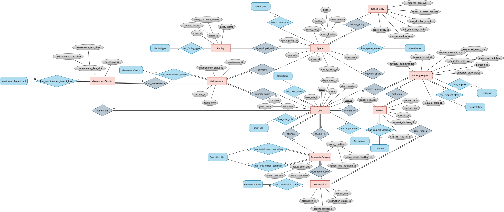

# Updated conceptual and logical ER models

Of course, as the business requirement changes, the ER diagrams must also alter accordingly. Given below are the updated conceptual and logical ER diagrams. These diagrams incorporate all modifications outlined in [step 08](./08-requirement-change-analysis-G06.md), including the decomposition of ternary relationships, the promotion of associative entities, the introduction of new reference entities, and the addition of new attributes.

## Updated conceptual ER diagram

## Updated logical ER diagram

### Summary of changes from Phase 1

1. **`Decision`** split into **`RequestState`** (pending, reviewed, cancelled, auto-approved) and **`RequestDecision`** (approved, rejected).
2. **`Review`** promoted from associative to operational entity with surrogate key `review_id`; associations decomposed into `evaluates` (→ BookingRequest) and `determines` (← User).
3. **`Booking`** ternary decomposed: `user_id` and `space_id` migrated as FKs directly onto `BookingRequest` via `makes_request` and `requests_space`.
4. **`ReservationCheckin`** renamed to **`ReservationSession`**, promoted to operational entity; associations decomposed into `attends` and `checks_in` (← User) and `from_reservation` (← Reservation).
5. **`Maintaining`** ternary decomposed: `technician_id` and `space_id` migrated onto `Maintenance` via `carries_out` and `services`; `maintenance_time_slot` moved into `Maintenance`.
6. New partition entity **`MaintenanceSession`** created, carrying `technician_id`, `maintenance_time_slot`, and `maintenance_impact_level_id`; linked to `Maintenance` via `from_maintenance`.
7. New reference entity **`MaintenanceImpactLevel`** (ADVISORY, OUT_OF_SERVICE).
8. **`BookingRequest`** gains `request_state_id` (→ RequestState) and `advisory_acknowledged`.
9. **`SpacePolicy`** gains `requires_approval` and `max_overrun_minutes`.
10. **`phone_number`** on `User` is no longer unique.
11. Fixed-length identifiers changed from `VARCHAR` to `CHAR`.

```mermaid
---
title: "Updated Logical ER Diagram — Phase 2 (Crow's Foot Notation)"
---
erDiagram

    %% ═══════════════════════════════════════
    %% REFERENCE / LOOKUP ENTITIES
    %% ═══════════════════════════════════════

    SpaceType {
        TINYINT space_type_id PK
        VARCHAR space_type_code UK
        NVARCHAR space_type_name
    }

    SpaceStatus {
        TINYINT space_status_id PK
        VARCHAR space_status_code UK
        NVARCHAR space_status_name
    }

    UserRole {
        TINYINT user_role_id PK
        VARCHAR user_role_code UK
        NVARCHAR user_role_name
    }

    UserStatus {
        TINYINT user_status_id PK
        VARCHAR user_status_code UK
        NVARCHAR user_status_name
    }

    Department {
        TINYINT department_id PK
        VARCHAR department_code UK
        NVARCHAR department_name
    }

    FacilityType {
        TINYINT facility_type_id PK
        VARCHAR facility_type_code UK
        NVARCHAR facility_type_name
    }

    Purpose {
        TINYINT purpose_id PK
        VARCHAR purpose_code UK
        NVARCHAR purpose_name
    }

    RequestState {
        TINYINT request_state_id PK
        VARCHAR request_state_code UK
        NVARCHAR request_state_name
    }

    RequestDecision {
        TINYINT request_decision_id PK
        VARCHAR request_decision_code UK
        NVARCHAR request_decision_name
    }

    ReservationStatus {
        TINYINT reservation_status_id PK
        VARCHAR reservation_status_code UK
        NVARCHAR reservation_status_name
    }

    SpaceCondition {
        TINYINT space_condition_id PK
        VARCHAR space_condition_code UK
        NVARCHAR space_condition_name
    }

    MaintenanceStatus {
        TINYINT maintenance_status_id PK
        VARCHAR maintenance_status_code UK
        NVARCHAR maintenance_status_name
    }

    MaintenanceImpactLevel {
        TINYINT maintenance_impact_level_id PK
        VARCHAR maintenance_impact_level_code UK
        NVARCHAR maintenance_impact_level_name
    }

    %% ═══════════════════════════════════════
    %% OPERATIONAL ENTITIES
    %% ═══════════════════════════════════════

    SpacePolicy {
        CHAR space_policy_id PK
        SMALLINT booking_window_days
        SMALLINT min_duration_minutes
        SMALLINT max_duration_minutes
        SMALLINT check_in_grace_minutes
        BIT requires_approval
        SMALLINT max_overrun_minutes
    }

    User {
        CHAR user_id PK
        NVARCHAR surname
        NVARCHAR given_name
        NVARCHAR email UK
        VARCHAR phone_number
        TINYINT user_role_id FK
        TINYINT department_id FK
        TINYINT user_status_id FK
    }

    Space {
        VARCHAR space_id PK
        NVARCHAR space_name
        TINYINT space_type_id FK
        CHAR building
        TINYINT floor
        TINYINT room_number
        SMALLINT capacity
        TINYINT space_status_id FK
        CHAR space_policy_id FK
    }

    Facility {
        TINYINT facility_type_id PK, FK
        INT facility_sequence_number PK
        NVARCHAR facility_name
        VARCHAR space_id FK
    }

    BookingRequest {
        CHAR booking_request_id PK
        CHAR user_id FK
        VARCHAR space_id FK
        DATETIME request_creation_time
        DATETIME requested_start_time
        DATETIME requested_end_time
        TINYINT purpose_id FK
        SMALLINT expected_participants
        TINYINT request_state_id FK
        BIT advisory_acknowledged
    }

    Review {
        CHAR review_id PK
        CHAR booking_request_id FK
        CHAR reviewer_id FK
        TINYINT request_decision_id FK
        DATETIME decision_time
        NVARCHAR decision_note
        NVARCHAR rejection_reason
    }

    Reservation {
        CHAR reservation_id PK
        CHAR booking_request_id FK
        TINYINT reservation_status_id FK
        NVARCHAR usage_note
    }

    ReservationSession {
        CHAR reservation_id PK, FK
        CHAR attendant_id FK
        CHAR check_in_user_id FK
        DATETIME actual_start_time
        DATETIME actual_end_time
        TINYINT space_initial_condition_id FK
        TINYINT space_final_condition_id FK
    }

    Maintenance {
        CHAR maintenance_id PK
        CHAR reporter_id FK
        VARCHAR space_id FK
        NVARCHAR maintenance_description
        TINYINT maintenance_status_id FK
        NVARCHAR result_note
    }

    MaintenanceSession {
        CHAR maintenance_id PK, FK
        CHAR technician_id FK
        DATETIME maintenance_start_time
        DATETIME maintenance_end_time
        TINYINT maintenance_impact_level_id FK
    }

    %% ═══════════════════════════════════════
    %% RELATIONSHIPS — Reference / Lookup
    %% ═══════════════════════════════════════

    UserRole ||--o{ User : "assigned_to"
    Department o|--o{ User : "has_member"
    UserStatus ||--o{ User : "classifies"

    SpaceType o|--o{ Space : "classifies"
    SpaceStatus ||--o{ Space : "classifies"
    SpacePolicy ||--|{ Space : "governs"

    FacilityType ||--o{ Facility : "classifies"

    Purpose o|--o{ BookingRequest : "classifies"
    RequestState ||--o{ BookingRequest : "classifies"

    RequestDecision ||--o{ Review : "classifies"

    ReservationStatus ||--o{ Reservation : "classifies"

    ReservationSession |o--o{ SpaceCondition : "initial_condition"
    ReservationSession |o--o{ SpaceCondition : "final_condition"

    MaintenanceStatus ||--o{ Maintenance : "classifies"

    MaintenanceImpactLevel ||--o{ MaintenanceSession : "classifies"

    %% ═══════════════════════════════════════
    %% RELATIONSHIPS — Operational
    %% ═══════════════════════════════════════

    %% Space-Facility: a space is equipped with facilities
    Space ||--o{ Facility : "is_equipped_with"

    %% BookingRequest: user makes_request, requests_space
    User ||--o{ BookingRequest : "makes_request"
    Space ||--o{ BookingRequest : "requests_space"

    %% Review: evaluates a booking request, determined by a user
    BookingRequest ||--o{ Review : "evaluates"
    User ||--o{ Review : "determines"

    %% Reservation: from_request
    BookingRequest |o--|| Reservation : "from_request"

    %% ReservationSession: from_reservation, attends, checks_in
    Reservation |o--|| ReservationSession : "from_reservation"
    User ||--o{ ReservationSession : "attends"
    User ||--o{ ReservationSession : "checks_in"

    %% Maintenance: reports_space, services
    User ||--o{ Maintenance : "reports"
    Space ||--o{ Maintenance : "services"

    %% MaintenanceSession: from_maintenance, carries_out
    Maintenance |o--|| MaintenanceSession : "from_maintenance"
    User ||--o{ MaintenanceSession : "carries_out"
```

### Entity inventory

The updated schema contains **23 tables** total:

| Category | Count | Entities |
|---|---|---|
| Reference / Lookup | 13 | SpaceType, SpaceStatus, UserRole, UserStatus, Department, FacilityType, Purpose, RequestState, RequestDecision, ReservationStatus, SpaceCondition, MaintenanceStatus, MaintenanceImpactLevel |
| Operational | 10 | User, Space, SpacePolicy, Facility, BookingRequest, Review, Reservation, ReservationSession, Maintenance, MaintenanceSession |

SpacePolicy is counted as operational because it contains structured policy attributes rather than the standard three-column lookup pattern.

### Relationship summary

| Relationship | Type | From Entity → To Entity | From Card. | To Card. |
|---|---|---|---|---|
| has_role | Lookup | User → UserRole | (1,1) | (0,N) |
| belongs_to | Lookup | User → Department | (0,1) | (0,N) |
| has_status | Lookup | User → UserStatus | (1,1) | (0,N) |
| has_type | Lookup | Space → SpaceType | (0,1) | (0,N) |
| has_status | Lookup | Space → SpaceStatus | (1,1) | (0,N) |
| governed_by | Lookup | Space → SpacePolicy | (1,1) | (1,N) |
| has_type | Lookup | Facility → FacilityType | (1,1) | (0,N) |
| has_purpose | Lookup | BookingRequest → Purpose | (0,1) | (0,N) |
| has_state | Lookup | BookingRequest → RequestState | (1,1) | (0,N) |
| has_decision | Lookup | Review → RequestDecision | (1,1) | (0,N) |
| has_status | Lookup | Reservation → ReservationStatus | (1,1) | (0,N) |
| initial_condition | Lookup | ReservationSession → SpaceCondition | (0,1) | (0,N) |
| final_condition | Lookup | ReservationSession → SpaceCondition | (0,1) | (0,N) |
| has_status | Lookup | Maintenance → MaintenanceStatus | (1,1) | (0,N) |
| has_impact_level | Lookup | MaintenanceSession → MaintenanceImpactLevel | (1,1) | (0,N) |
| is_equipped_with | Binary 1:N | Space → Facility | (0,N) | (1,1) |
| makes_request | Binary 1:N | User → BookingRequest | (0,N) | (1,1) |
| requests_space | Binary N:1 | BookingRequest → Space | (1,1) | (0,N) |
| evaluates | Binary N:1 | Review → BookingRequest | (1,1) | (0,N) |
| determines | Binary 1:N | User → Review | (0,N) | (1,1) |
| from_request | Binary 1:1 | Reservation → BookingRequest | (1,1) | (0,1) |
| from_reservation | Binary 1:1 | ReservationSession → Reservation | (1,1) | (0,1) |
| attends | Binary 1:N | User → ReservationSession | (0,N) | (1,1) |
| checks_in | Binary 1:N | User → ReservationSession | (0,N) | (1,1) |
| reports | Binary 1:N | User → Maintenance | (0,N) | (1,1) |
| services | Binary N:1 | Maintenance → Space | (1,1) | (0,N) |
| from_maintenance | Binary 1:1 | MaintenanceSession → Maintenance | (1,1) | (0,1) |
| carries_out | Binary 1:N | User → MaintenanceSession | (0,N) | (1,1) |
### Final modeling decisions

- Semester reports accept reproducible start/end parameters; no semester table is required.
- Current approval includes `AUTO_APPROVED` or the latest approved Review decision.
- The booking-level advisory flag is retained as the minimum requirement; per-advisory history is a future audit enhancement.
- Maintenance impact is current-state-only. Affected bookings are calculated when an advisory is escalated.